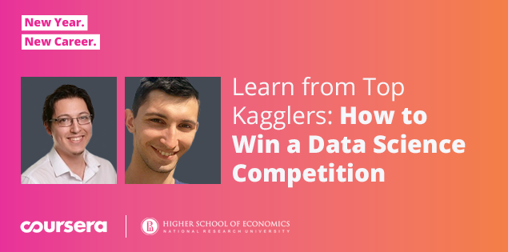

> Coursera Course

# How to Win a Data Science Competition : Learn from Top Kagglers

<https://www.coursera.org/learn/competitive-data-science/home/welcome>

Data Science 공부 + Kaggle 실습

이 강좌의 과제와 공부한 내용을 정리하기!

## Curriculum

1. Week 1
    - Welcome to "How to win a data science competition"
    - Competition mechanics
    - Recap of main ML algorithms
    - Software/Hardware requirements
    - Featurue Preprocessing and Generation with Respect to Models

2. Week 2
3. Week 3
4. Week 4
5. Week 5